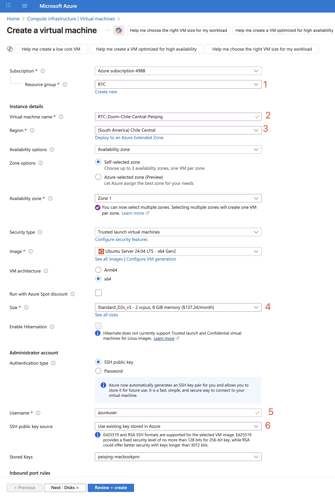
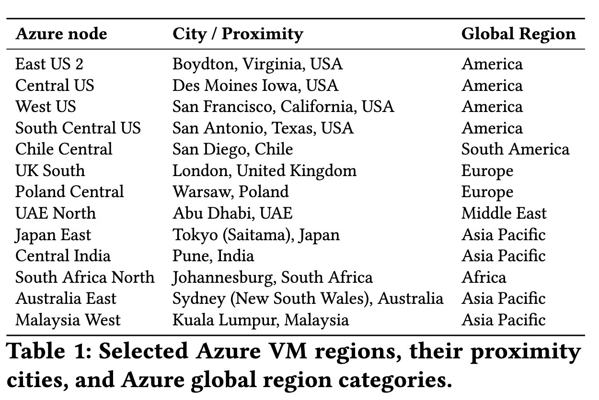
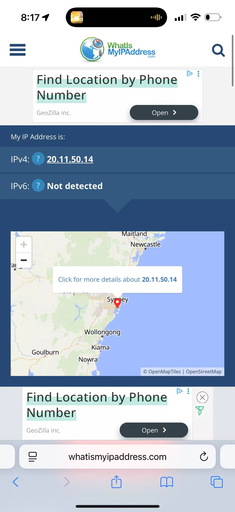

# 🛰️ RTC Relay Measurement Setup & Usage (Azure + WireGuard + Capture Controller)

This guide walks you through setting up **two Azure Ubuntu VMs**, configuring the **RTC capture service**, linking **phones via WireGuard VPN**, and running automated captures via the PowerShell controller script (`rtc_capture.ps1`).
It supports **relay IP detection**, **ASN/CIDR blocking**, and **geolocation lookup via ipinfo.io**.

---

## 🧩 1️⃣ VM Setup in Azure Portal

### **Create 2 Ubuntu VMs**

<!-- put in the AzureVMProvision.png here -->

1. Put all your 13 VMs in one resource group (e.g. RTC)
2. VM name put `RTC-<Your Application>-<Location>-<Name>` (for quicker search and resource usage check)
3. Choose a relay based on the following regions
   
4. Size: pick the cheapest VM you can get. If it says unavailable, you shall either pick a more expensive one, or change zone (see availability zone)
5. Don't change "azureuser" as the username. Our script sticks to this name to run.
6. Upload your key to Azure to reuse for all servers.

* Region examples: `West Europe` and `Southeast Asia`
* **Size:** 2 vCPUs, 4 GB RAM (Standard_B2s works fine)
* **Image:** Ubuntu Server 20.04 LTS or 22.04 LTS
* **Authentication:** SSH key (generate or reuse one)

  ```bash
  ssh-keygen -t rsa -b 4096 -f ~/.ssh/azure_rtc
  ```
* Copy the **public key** to both VMs during creation.

---

### **Networking Configuration (via Azure Portal)**

Go to each VM → **Networking → Add inbound port rules:**

| Purpose         | Port  | Protocol | Source | Action |
| --------------- | ----- | -------- | ------ | ------ |
| RTC Capture API | 5000  | TCP      | Any    | Allow  |
| WireGuard VPN   | 51820 | UDP      | Any    | Allow  |
| SSH Access      | 22    | TCP      | My IP  | Allow  |

> ✅ This enables the capture API, VPN tunnel, and remote control access.

---

<span style="color:red"><b>For the rest of the installation, the easy way is:</b></span>

```bash
curl -sSL https://raw.githubusercontent.com/chandanacharithap/rtcproxy/main/install.sh | bash
```


## ⚙️ 2️⃣ Install Dependencies on Each VM

Connect via SSH:

```bash
ssh -i ~/.ssh/azure_rtc azureuser@<VM_PUBLIC_IP>
```

Install required packages:

```bash
sudo apt update && sudo apt upgrade -y
sudo apt install -y python3 python3-pip tshark git wireguard qrencode whois
```

Install and enterpython venv:
```
sudo apt install python3.12-venv
mkdir -p "$HOME/.venvs"
python3 -m venv "$HOME/.venvs/rtcproxy"
source "$HOME/.venvs/rtcproxy/bin/activate"
```

---

## 🧠 3️⃣ Clone Repo and Setup API Service

```bash
sudo git clone https://github.com/chandanacharithap/rtcproxy.git /opt/rtcproxy
cd /opt/rtcproxy
pip3 install -r requirements.txt
```

Ensure `api.py` and `check_dpi.py` exist:

```bash
ls /opt/rtcproxy
```

Create a systemd service:

```bash
sudo mkdir -p /var/log/rtc
sudo chown azureuser:azureuser /var/log/rtc
sudo chmod 777 /var/log/rtc
sudo tee /etc/systemd/system/rtcproxy.service <<EOF
[Unit]
Description=RTC Capture API
After=network.target

[Service]
User=azureuser
ExecStart=/home/azureuser/.venvs/rtcproxy/bin/python /opt/rtcproxy/api.py
WorkingDirectory=/opt/rtcproxy
Restart=always
Environment=PYTHONUNBUFFERED=1

[Install]
WantedBy=multi-user.target
EOF
```

Enable and start the API:

```bash
sudo systemctl daemon-reexec
sudo systemctl enable rtcproxy
sudo systemctl start rtcproxy
sudo systemctl status rtcproxy
```

> Should show **active (running)** and **Listening on 0.0.0.0:5000**

---

## 🔐 4️⃣ WireGuard Setup (Phone ↔ VM)

This section turns the VM into a routable WireGuard server and auto-generates two phone client configs with QR codes (IPv4/IPv6 forwarding, NAT, MSS clamp). Only Part 0 and Part A are covered here; the rtcproxy service is in the next section.

### Part 0 — Become root (stay root)

Run after SSH into the VM:

```bash
sudo -i
set -euxo pipefail
export DEBIAN_FRONTEND=noninteractive
```

### Part A — WireGuard server + routing + QR codes (runs as root)

1) Packages

```bash
apt-get update -y
apt-get install -y wireguard wireguard-tools qrencode tcpdump curl \
                   iptables-persistent netfilter-persistent
```

2) Kernel routing & rp_filter (persist + live)

```bash
tee /etc/sysctl.d/99-wg-routing.conf >/dev/null <<'SYS'
net.ipv4.ip_forward=1
net.ipv6.conf.all.forwarding=1
net.ipv4.conf.all.rp_filter=0
net.ipv4.conf.default.rp_filter=0
SYS

sysctl --system >/dev/null
sysctl -w net.ipv4.ip_forward=1
sysctl -w net.ipv6.conf.all.forwarding=1
sysctl -w net.ipv4.conf.all.rp_filter=0
sysctl -w net.ipv4.conf.default.rp_filter=0
```

3) Generate keys (idempotent) & build configs

```bash
WG_IF=wg0
WG_DIR=/etc/wireguard
KEEPALIVE=25
DNS_ADDR=1.1.1.1

umask 077
mkdir -p "$WG_DIR"; chmod 700 "$WG_DIR"; cd "$WG_DIR"
[ -f server_private.key ] || (wg genkey | tee server_private.key | wg pubkey > server_public.key)
[ -f phone1_private.key ] || (wg genkey | tee phone1_private.key | wg pubkey > phone1_public.key)
[ -f phone2_private.key ] || (wg genkey | tee phone2_private.key | wg pubkey > phone2_public.key)

SERVER_PRIV="$(cat server_private.key)"
SERVER_PUB="$(cat server_public.key)"
P1_PRIV="$(cat phone1_private.key)"
P1_PUB="$(cat phone1_public.key)"
P2_PRIV="$(cat phone2_private.key)"
P2_PUB="$(cat phone2_public.key)"

SERVER_ADDR=10.8.0.1/24
P1_ADDR=10.8.0.2/24
P2_ADDR=10.8.0.3/24

# Detect egress NIC (Azure typically eth0)
EGRESS_IF="$(ip route get 1.1.1.1 | awk '{for(i=1;i<=NF;i++){if($i=="dev"){print $(i+1); exit}}}')" || true
[ -z "$EGRESS_IF" ] && EGRESS_IF=eth0

# Autodetect public IP for client Endpoint
ENDPOINT="$(curl -s ifconfig.me 2>/dev/null):51820"
```

4) Server config (NAT, forward accept, MSS clamp, MTU)

```bash
cat > "$WG_DIR/${WG_IF}.conf" <<EOF
[Interface]
PrivateKey = ${SERVER_PRIV}
Address    = ${SERVER_ADDR}
ListenPort = 51820
MTU        = 1380

# NAT + FORWARD accept + MSS clamp (up/down)
PostUp   = iptables -t nat -A POSTROUTING -s 10.8.0.0/24 -o ${EGRESS_IF} -j MASQUERADE
PostUp   = iptables -A FORWARD -i ${WG_IF} -j ACCEPT
PostUp   = iptables -A FORWARD -o ${WG_IF} -j ACCEPT
PostUp   = iptables -t mangle -A FORWARD -i ${WG_IF} -p tcp --tcp-flags SYN,RST SYN -j TCPMSS --clamp-mss-to-pmtu
PostDown = iptables -t nat -D POSTROUTING -s 10.8.0.0/24 -o ${EGRESS_IF} -j MASQUERADE
PostDown = iptables -D FORWARD -i ${WG_IF} -j ACCEPT
PostDown = iptables -D FORWARD -o ${WG_IF} -j ACCEPT
PostDown = iptables -t mangle -D FORWARD -i ${WG_IF} -p tcp --tcp-flags SYN,RST SYN -j TCPMSS --clamp-mss-to-pmtu

[Peer]
# Phone 1
PublicKey  = ${P1_PUB}
AllowedIPs = 10.8.0.2/32
PersistentKeepalive = ${KEEPALIVE}

[Peer]
# Phone 2
PublicKey  = ${P2_PUB}
AllowedIPs = 10.8.0.3/32
PersistentKeepalive = ${KEEPALIVE}
EOF
```

5) Generate two phone client configs and QR codes

```bash
# Phone 1
cat > "$WG_DIR/phone1.conf" <<EOF
[Interface]
PrivateKey = ${P1_PRIV}
Address    = ${P1_ADDR}
DNS        = ${DNS_ADDR}

[Peer]
PublicKey  = ${SERVER_PUB}
Endpoint   = ${ENDPOINT}
AllowedIPs = 0.0.0.0/0, ::/0
PersistentKeepalive = ${KEEPALIVE}
EOF

# Phone 2
cat > "$WG_DIR/phone2.conf" <<EOF
[Interface]
PrivateKey = ${P2_PRIV}
Address    = ${P2_ADDR}
DNS        = ${DNS_ADDR}

[Peer]
PublicKey  = ${SERVER_PUB}
Endpoint   = ${ENDPOINT}
AllowedIPs = 0.0.0.0/0, ::/0
PersistentKeepalive = ${KEEPALIVE}
EOF
```

6) Harden permissions, enable service, and show QR codes

```bash
chown root:root "$WG_DIR"/*.conf "$WG_DIR"/*.key
chmod 600 "$WG_DIR"/*.conf "$WG_DIR"/*.key

systemctl enable wg-quick@${WG_IF}
systemctl restart wg-quick@${WG_IF}

echo '=========== Phone 1 (scan) ==========='
qrencode -t ansiutf8 < "$WG_DIR/phone1.conf"
echo '=========== Phone 2 (scan) ==========='
qrencode -t ansiutf8 < "$WG_DIR/phone2.conf"

# Quick sanity
wg | sed -n '1,30p' || true
```

On your phones: open WireGuard → “Add Tunnel” → “Scan QR Code” for both Phone 1 and Phone 2. **Make sure you scan the 2 QR codes on different phones. This is a super super super important step to support future test "caller and callee in the same location", as we will be using the same VM to delegate the media traffic for both the caller and callee phones.** 

After connecting, you should check your external IP at [whatismyipaddress.com](https://www.whatismyipaddress.com). It should show your VM's IP address and geolocation. Once you've verified that, the installation of the VPN is a success.



**Naming of the VPN nodes on WireGuard mobile App**
The naming of all 13 VPN nodes can affect the application automation script as it iterates over the 13 VPN nodes. You should name it as follows:
```
rtc-east-us
rtc-central-us
rtc-west-us
rtc-south-central-us
rtc-chile-central
rtc-uk-south
rtc-poland-central
rtc-uae-south
rtc-japan-east
rtc-central-india
rtc-south-africa-north
rtc-australia-east
rtc-malaysia-west
```

---

## 💻 5️⃣ Local Controller (Windows Machine)

Make sure you have:

* `rtc_capture.ps1` script in `C:\Users\chand`
* `scp` and `ssh` accessible from PowerShell (`where ssh` should show OpenSSH path)
* Your private key:
  `C:\Users\chand\.ssh\azure_rtc.pem`

Edit the top of `rtc_capture.ps1`:

```powershell
$VM1_IP    = "20.55.35.218"
$VM2_IP    = "20.24.57.248"
$SSH_KEY   = "C:\Users\chand\.ssh\azure_rtc.pem"
$USER      = "azureuser"
$BASE_DIR  = "C:\Users\chand\captures"
$BLOCK_FILE = "$BASE_DIR\blocking.txt"
$IPINFO_TOKEN = "YOUR_TOKEN_HERE"  # Optional
$REGION1   = "west-europe"
$REGION2   = "south-east-asia"
```

---

## 🧪 6️⃣ Running a Capture

Turn **on WireGuard** on both phones.
Start a Zoom / Meet / WhatsApp / Teams call.
Then, in PowerShell:

```powershell
cd C:\Users\chand
.\rtc_capture.ps1
```

✅ The script will:

1. Start capture on both VMs (`/start`)
2. Record for 30 seconds
3. Stop capture (`/stop`)
4. Download PCAPs
5. Run `check_dpi.py` remotely
6. Show relay IPs, geolocation, and top IPs
7. Offer to block detected relays (iptables)

---

## 📊 7️⃣ Example Output

```
========== ANALYSIS DONE ==========
VM1 (20.55.35.218):
Relay found from DPI: 206.247.43.41 (San Jose, US, Zoom)

Top 5 IPs:
206.247.43.41, 61k pkts (relay)
151.101.3.6, 418 pkts
1.0.0.1, 98 pkts

VM2 (20.24.57.248):
Relay found from DPI: 206.247.43.41 (San Jose, US, Zoom)
...
===================================
Captured files stored in: C:\Users\chand\captures\west-europe-south-east-asia-run_5
```

---

## 🚫 8️⃣ Blocking Relay Subnets Automatically

When prompted:

```
Relay IP detected: 206.247.43.41
Press 'b' to block this relay subnet 206.247.0.0/16 (or Enter to skip):
```

If you press **b**, the script:

* Adds subnet to `blocking.txt`
* Applies `iptables` rules on both VMs:

  ```
  sudo iptables -I FORWARD -d <subnet> -j DROP
  sudo iptables -I FORWARD -s <subnet> -j DROP
  sudo iptables -I OUTPUT -d <subnet> -j DROP
  sudo iptables -I INPUT -s <subnet> -j DROP
  ```

---

## 💡 9️⃣ Notes & Gotchas

* Uses **ipinfo.io** for location lookup (replace `YOUR_TOKEN_HERE` with real token).
* Private IPs (`172.x`, `192.168.x`) are skipped — those are internal tunnels.
* If `check_dpi.py` shows only `172.x` IPs, you’ve blocked all public relays — the app may fall back to local peers.
* Output and logs are stored per run under:

  ```
  C:\Users\chand\captures\<region1>-<region2>-run_<N>\
  ```

* **For business accounts**, we have set up 2 accounts for Zoom, Google Meet, and Microsoft Teams. See login instructions [here](https://docs.google.com/spreadsheets/d/1mPv7KNgY9s4xKgqWKOYSE27-RdRJQZg1zn9V6VfSwWg/edit?gid=0#gid=0). The accounts are paid monthly.


---

## ⚡ That’s It!

